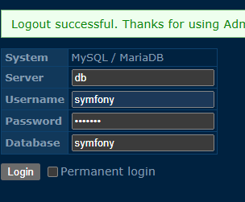

# Docker
    Install docker on your local machine.

# Install make from Chocolatey windows. 
    choco install make

# Install make for linux.
    sudo apt install make

# Build docker container.
    make build

[http://localhost:8080](http://localhost:8080)

# Run  all this commands inside docker container!!!
    
# Create base symfony skeleton.
    composer create-project symfony/skeleton .
    
#twig template.
    composer require twig
    
# Doctrine orm-pack.
    composer require symfony/orm-pack

# Doctrine bundle.
    composer require doctrine/doctrine-bundle
# Doctrine annotations.    
    composer require doctrine/annotations
# Bundle --dev.    
    composer require symfony/maker-bundle --dev

# Migrations
    php bin/console make:migration

# Migrate 
    php bin/console doctrine:migrations:migrate

# Adminer for manage database
[http://localhost:8080/adminer.php](http://localhost:8080/adminer.php)

Server: db

Username: symfony

Password: symfony

Database: symfony

# Dummy Data with Fixtures.
    composer require --dev doctrine/doctrine-fixtures-bundle

    # Fill database dummy data.
        php bin/console doctrine:fixtures:load

# Add api to project.
    composer require api

[http://localhost:8080/api](http://localhost:8080/api)

# Add tool for testing.
    composer require --dev symfony/test-pack

# Run Tests.
    php bin/phpunit

